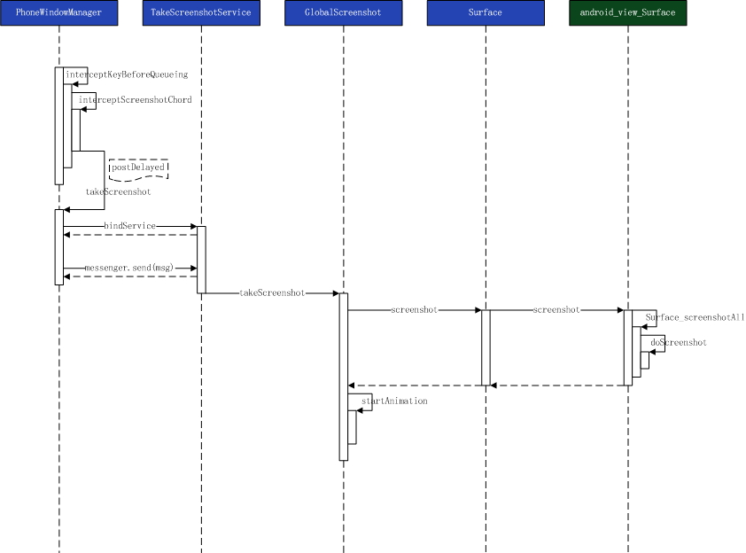

# Android系统截图监听

## 参考链接

[Android 截屏监听（截图分享功能实现）](https://www.jianshu.com/p/d7aba5a03b0f)

[Android 截屏事件监听](https://juejin.im/entry/58647ee9128fe1006d0f4454)

## 实现方案

Android系统没有直接对截屏事件监听的接口，也没有广播，只能自己动手来丰衣足食，一般有三种方法。

1. 利用FileObserver监听某个目录中资源变化情况
2. 利用ContentObserver监听全部资源的变化
3. 监听截屏快捷按键  ( 由于厂商自定义Android系统的多样性，再加上快捷键的不同以及第三方应用，监听截屏快捷键这事基本不靠谱，可以直接忽略 )

## Android系统截屏流程



注：Android10的系统截图保存图片的代码与Android9不同，测试下来使用ContentObserver检测不到截图文件的添加，使用FileObserver可以，所以在最后的实现时，同时使用FileObserver和ContentObserver实现截图监听。

## FileObserver 与 ContentObserver 比较

### FileObserver方案

 通过FileObserver监听截屏文件夹，当有新的截屏文件产生时，调用设定的回调函数执行相关操作

   **优点:**  实现简单

   **缺点:**

    1. 不同手机默认的截屏路径可能不同，需要做适配处理
    2. 不同手机截屏触发的事件名称可能不同，需要测试适配
    3. 监听到截屏事件后马上获取图片获取不到，需要延迟一段时间

### ContentObserver方案

通过ContentObserver监听多媒体图片库资源的变化。当手机上有新的图片文件产生时都会通过MediaProvider类向图片数据库插入一条记录，以方便系统的图片库进行图片查询，可以通过ContentObserver接收图片插入事件，并获取插入图片的URI。

   **优点:**  不同手机触发的事件是一样的

   **缺点:**

   1. 不同手机截屏文件的前缀可能不同，需要做适配
   2. 监听到截屏事件后马上获取图片获取不到，需要延迟一段时间

## FileObserver实现

### 先奉上回调接口

```Java

interface IScreenshotCallback {
    void screenshotTaken(String path);

    /**
     * 代理类
     */
    public abstract class ScreenshotCallbackProxy implements IScreenshotCallback {

        /**
         * 上次的截图文件路径，用于去重
         */
        private static String lastShotPath = "";

        @Override
        public void screenshotTaken(String path) {
            if (TextUtils.equals(path, lastShotPath)) {
                return;
            }
            lastShotPath = path;
            onGetScreenshot(path);
        }

        public abstract void onGetScreenshot(String path);
    }
}

```

### 权限

``` Xml
    <?xml version="1.0" encoding="utf-8"?>
    <manifest>
        <!-- 文件读写权限 -->
        <uses-permission android:name="android.permission.WRITE_EXTERNAL_STORAGE" />
        <uses-permission android:name="android.permission.READ_EXTERNAL_STORAGE" />
    </manifest>
```

### 关键实现类

```Java

/**
 * @author ： jsongo
 * @date ： 2019/12/9 14:38
 * @desc : 使用文件观察者监听
 */
public class ScreenshotFileObserver {

    /**
     * 适配各手机的截屏文件夹路径
     */
    private static String SNAP_SHOT_FOLDER_PATH;

    /**
     * 获取截图路径
     *
     * @return
     */
    public static synchronized String getSnapShotFolderPath() {
        if (TextUtils.isEmpty(SNAP_SHOT_FOLDER_PATH)) {
            //使用pictures下的screenshots,如果不存在，使用camera下的screenshots
            SNAP_SHOT_FOLDER_PATH = Environment.getExternalStorageDirectory()
                    + File.separator + Environment.DIRECTORY_PICTURES
                    + File.separator + "Screenshots" + File.separator;
            if (!new File(SNAP_SHOT_FOLDER_PATH).exists()) {
                SNAP_SHOT_FOLDER_PATH = Environment.getExternalStorageDirectory()
                        + File.separator + Environment.DIRECTORY_DCIM
                        + File.separator + "Screenshots" + File.separator;
            }
        }
        return SNAP_SHOT_FOLDER_PATH;
    }

    /**
     * 上次的截图文件路径，用于去重
     */
    private static String lastShotPath = "";

    /**
     * 延迟获取图片的尝试次数
     */
    private static int MAX_TRYS = 20;

    public static FileObserver initFileObserver(IScreenshotCallback screenshotCallback) {
        final FileObserver fileObserver = new FileObserver(getSnapShotFolderPath(), FileObserver.ALL_EVENTS) {
            @Override
            public void onEvent(int event, @Nullable String path) {
                if (!TextUtils.isEmpty(path) && event == FileObserver.CREATE && (!TextUtils.equals(path, lastShotPath))) {
                    lastShotPath = path;
                    String filePath = SNAP_SHOT_FOLDER_PATH + path;
                    int tryTime = 0;
                    while (true) {
                        try {
                            //收到事件后需要延迟获取
                            Thread.sleep(600);
                        } catch (InterruptedException e) {
                            e.printStackTrace();
                        }
                        try {
                            BitmapFactory.decodeFile(filePath);
                            break;
                        } catch (Exception e) {
                            e.printStackTrace();
                            tryTime++;
                            if (tryTime >= MAX_TRYS) {
                                return;
                            }
                        }
                    }
                    screenshotCallback.screenshotTaken(filePath);
                }
            }
        };
        return fileObserver;
    }
}
```

使用`initFileObserver`方法进行初始化并获取到`FileObserver`对象，使用`FileObserver#startWatching`方法开启监听，`FileObserver#stopWatching`进行销毁。

**注：** 初始化方法尽量早调用，否则可能接收不到回调。

## ContentObserver

### 权限

``` Xml
    <?xml version="1.0" encoding="utf-8"?>
    <manifest>
        <!-- 文件读写权限 -->
        <uses-permission android:name="android.permission.WRITE_EXTERNAL_STORAGE" />
        <uses-permission android:name="android.permission.READ_EXTERNAL_STORAGE" />	<!-- 监听媒体数据库需要的权限 -->
        <uses-permission android:name="MediaStore.Images.Media.INTERNAL_CONTENT_URI" />
        <uses-permission android:name="MediaStore.Images.Media.EXTERNAL_CONTENT_URI" />
    </manifest>
```

### 关键实现类

```Java
/**
 * @author ： jsongo
 * @date ： 2019/12/9 10:19
 * @desc : 媒体内容观察者
 */
public class MediaContentObserver extends ContentObserver {

    /**
     * 读取媒体数据库时需要读取的列
     */
    private static final String[] MEDIA_PROJECTIONS = {
            MediaStore.Images.ImageColumns.DATA,
            MediaStore.Images.ImageColumns.DATE_TAKEN,
            MediaStore.Images.ImageColumns.DATE_ADDED
    };

    /**
     * 判断是否是截图图片的文件名关键字
     */
    private static final String[] KEYWORDS = {
            "screenshot", "screen_shot", "screen-shot", "screen shot",
            "screencapture", "screen_capture", "screen-capture", "screen capture",
            "screencap", "screen_cap", "screen-cap", "screen cap"
    };

    private final Uri contentUri;

    private final ContentResolver contentResolver;
    private final IScreenshotCallback screenshotCallback;

    public MediaContentObserver(Uri contentUri, Handler handler, ContentResolver contentResolver, IScreenshotCallback screenshotCallback) {
        super(handler);
        this.contentUri = contentUri;
        this.contentResolver = contentResolver;
        this.screenshotCallback = screenshotCallback;
    }

    @Override
    public void onChange(boolean selfChange) {
        super.onChange(selfChange);
        handleMediaContentChange(contentUri);
    }

    /**
     * 处理媒体内容更变
     *
     * @param contentUri
     */
    private void handleMediaContentChange(Uri contentUri) {
        Cursor cursor = null;
        try {
            cursor = contentResolver.query(contentUri, MEDIA_PROJECTIONS, null, null, MediaStore.Images.ImageColumns.DATE_ADDED + " desc limit 1");

            if (cursor == null || !cursor.moveToFirst()) {
                return;
            }
            final int dateIndex = cursor.getColumnIndex(MediaStore.Images.ImageColumns.DATA);
            final int dateTakenIndex = cursor.getColumnIndex(MediaStore.Images.ImageColumns.DATE_TAKEN);
            final int dateAddIndex = cursor.getColumnIndex(MediaStore.Images.ImageColumns.DATE_ADDED);

            final String data = cursor.getString(dateIndex);
            final long dateTaken = cursor.getLong(dateTakenIndex);
            final long dateAdd = cursor.getLong(dateAddIndex);
            //处理获取到的第一行数据
            handleMediaRowData(data, dateTaken, dateAdd);

        } catch (Exception e) {
            e.printStackTrace();
        } finally {
            if (cursor != null && !cursor.isClosed()) {
                cursor.close();
            }
        }
    }

    /**
     * 处理监听到的资源
     *
     * @param path
     * @param dateTaken
     * @param dateAdd
     */
    private void handleMediaRowData(String path, long dateTaken, long dateAdd) {
        long duration = 0;
        long step = 100;

        if (!isTimeValid(dateAdd)) {
            return;
        }

        //设置最大等待时间500ms （因为某些魅族手机保存有延迟）
        while (!checkScreenShot(path) && duration <= 500) {
            try {
                duration += step;
                Thread.sleep(step);
            } catch (InterruptedException e) {
                e.printStackTrace();
            }
        }
        if (checkScreenShot(path)) {
            if (screenshotCallback != null) {
                screenshotCallback.screenshotTaken(path);
            }
        } else {
            //没有截屏事件
        }
    }

    /**
     * 插入时间小于1s才有效
     * <p>
     * 个别手机会自己修改截图文件夹的文件， 截屏功能会误以为是用户在截屏操作，进行捕获。 加了一个时间判断
     *
     * @param dateAdd
     * @return
     */
    private boolean isTimeValid(long dateAdd) {
        return Math.abs(System.currentTimeMillis() / 1000 - dateAdd) < 1;
    }

    /**
     * 判断是否是截屏图片
     *
     * @param path
     * @return
     */
    private boolean checkScreenShot(String path) {
        if (TextUtils.isEmpty(path)) {
            return false;
        }
        path = path.toLowerCase();
        for (String keyword : KEYWORDS) {
            if (path.contains(keyword)) {
                return true;
            }
        }
        return false;
    }

}
```

下面贴上使用的类：

```Java
class ContentObserverManager {

        private static ContentResolver contentResolver;
        private static IScreenshotCallback screenshotCallback;
        private static HandlerThread screenshotHandlerThread;
        private static Handler handler;
        private static MediaContentObserver internalObserver;
        private static MediaContentObserver externalObserver;

        /**
         * 初始化
         *
         * @param resolver
         * @param callback
         */
        public static void init(ContentResolver resolver, IScreenshotCallback callback) {
            contentResolver = resolver;
            screenshotCallback = callback;

            screenshotHandlerThread = new HandlerThread("Screenshot_Observer");
            screenshotHandlerThread.start();
            handler = new Handler(screenshotHandlerThread.getLooper());

            internalObserver = new MediaContentObserver(MediaStore.Images.Media.INTERNAL_CONTENT_URI, handler, contentResolver, screenshotCallback);
            externalObserver = new MediaContentObserver(MediaStore.Images.Media.EXTERNAL_CONTENT_URI, handler, contentResolver, screenshotCallback);
        }


        /**
         * 注册
         */
        public static void register() {
            contentResolver.registerContentObserver(MediaStore.Images.Media.INTERNAL_CONTENT_URI, false, internalObserver);
            contentResolver.registerContentObserver(MediaStore.Images.Media.EXTERNAL_CONTENT_URI, false, externalObserver);
        }

        /**
         * 解除注册
         */
        public static void unregister() {
            contentResolver.unregisterContentObserver(internalObserver);
            contentResolver.unregisterContentObserver(externalObserver);

            contentResolver = null;
            screenshotCallback = null;
            screenshotHandlerThread = null;
            handler = null;
            internalObserver = null;
            externalObserver = null;
        }
    }
```

## 封装Util，同时使用两种方式

```Java
/**
 * @author ： jsongo
 * @date ： 2019/12/9 11:03
 * @desc : 截屏监听工具,同时使用contentobserver和fileobserver
 */
public class ScreenshotObserveUtil {

    public static void init(ContentResolver resolver, IScreenshotCallback callback) {
        FileObserverManager.init(callback);
        ContentObserverManager.init(resolver, callback);
    }

    /**
     * 监听
     */
    public static void register() {
        FileObserverManager.register();
        ContentObserverManager.register();
    }

    /**
     * 停止监听
     */
    public static void unregister() {
        FileObserverManager.unregister();
        ContentObserverManager.unregister();
    }


    static class FileObserverManager {

        private static FileObserver fileObserver;

        public static void init(IScreenshotCallback callback) {
            fileObserver = ScreenshotFileObserver.initFileObserver(callback);
        }

        /**
         * 监听
         */
        public static void register() {
            fileObserver.startWatching();
        }

        /**
         * 停止监听
         */
        public static void unregister() {
            fileObserver.stopWatching();
        }

    }

    static class ContentObserverManager {
        //此处省略上述代码
    }
}

```

使用示例：

```Java
public class ScreenshotObserveActivity extends AppCompatActivity {

    private static final String TAG = "ScreenshotObserveActivi";

    /**
     * 截屏监听回调
     */
    private IScreenshotCallback screenshotCallback;

    @Override
    protected void onCreate(Bundle savedInstanceState) {
        super.onCreate(savedInstanceState);

        setContentView(R.layout.activity_screenshot_observe);
        final TextView tv = findViewById(R.id.tv);
        //mark 创建截屏监听回调
        screenshotCallback = new IScreenshotCallback.ScreenshotCallbackProxy() {
            @Override
            public void onGetScreenshot(String path) {
                String tip = "screenshotTaken:image path --> " + path;
                Log.e(TAG, tip);
                Log.e(TAG, "onGetScreenshot: " + Thread.currentThread().getName());
                runOnUiThread(new Runnable() {
                    @Override
                    public void run() {
                        final CharSequence text = tv.getText();
                        tv.setText(text + "\n" + tip);
                    }
                });
            }
        };
        //mark 初始化截屏监听工具
        ScreenshotObserveUtil.init(getContentResolver(), screenshotCallback);
        //mark 注册截屏监听
        ScreenshotObserveUtil.register();
    }

    @Override
    protected void onDestroy() {
        //mark 解除监听，对象销毁
        ScreenshotObserveUtil.unregister();
        super.onDestroy();
    }

}
```
