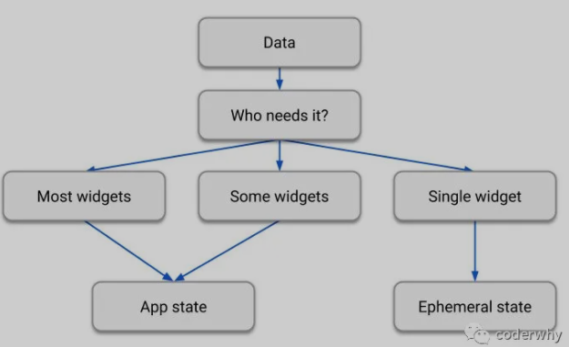

# Flutter

[原文链接](https://mp.weixin.qq.com/s?__biz=Mzg5MDAzNzkwNA==&mid=2247483789&idx=1&sn=c552cb4aba354ce3509d39b402e4c7c2&chksm=cfe3f272f8947b6402e9ba08af81ae05ee87176e81b0e06b025bf651e7f1434823b34017d2d2&scene=178&cur_album_id=1566028536430247937#rd)
## 状态管理

状态管理是声明式编程非常重要的一个概念

### 为什么需要状态管理

#### 1.1 认识状态管理

命令式编程  -->  声明式编程

UI = f(state)
The_layout_on_the_screen = your_build_methods(the_application_state)

#### 1.2 状态管理分类

##### 1.2.1 短时状态Ephemeral state

某些状态只需要在自己的Widget中可用

- 比如简单计数器counter
- 比如PageView组件记录当前页面
- 比如动画记录当前进度
- 比如BottomNavigationBar中当前被选中的tab

这种状态只需是使用StatefulWidget的State类自己管理即可，Widget树中的其他部分不需要访问这个状态

##### 1.2.2 应用状态APP State

- 比如用户个性化选项
- 比如用户登录状态信息
- 比如电商应用购物车
- 比如新闻应用的已读消息或未读消息

这种状态如果在Widget中传递，比较繁杂，代码耦合度变得非常高，代码质量、后期维护、可扩展性都非常差

##### 1.2.3 如何选择不同的管理方式

- 某些短时状态可能在之后的开发维护中需要升级为应用状态

但我们可以简单的遵守下面流程图中的规则



针对React使用setState还是Redux中的Store来管理状态哪个更好的问题，Redux的issue上，Redux的作者如是回答：

```txt
Thr rule of thumb is: Do whatwear is less awkward.
```

经验原则就是：选择能够减少麻烦的方式

### 共享状态管理

#### 2.1 InheritedWidget

InheritedWidget 与 React 中的 context功能类似，可实现跨组件数据传递

定义一个共享数据的InheritedWidget，需要继承自InheritedWidget

- 这里定义of方法，该方法通过context开始去查找祖先HYDataWidget（可查看源码查找过程）
- updateShouldNotify 方法是对比新旧HYDataWidget，是否需要对更新相关依赖的Widget

```dart
class HYDataWidget extends InheritedWidget {
    final int counter;

    HYDataWidget({this.counter, Widget child}): super(child: child);

    static HYDataWidget of(BuildContext context) {
        //可以传递泛型参数或方法形参
        return context.dependOnInheritedWidgetOfExactType();
    }

    @override
    bool updateShouldNotify(HYDataWidget oldWidget) {
        return this.counter != oldWidget.counter;
    }
}
```

创建HYDateWidget，并传入数据（这里点击按钮会修改数据，并且重新build）

```dart
class HYHomePage extends StatefulWidget {
    @overrde
    _HYHomePageState createState() => _HYHomePageState();
}

class _HYHomePageState extends State<HYHomePage> {
    int data = 100;

    @override
    Widget build(BuildContext context) {
        return Scaffold(
            appBar: AppBar(
                title: Text("InheritedWidget"),
            ),
            body: HYDataWidget(
                counter: data,
                child: Center(
                    child: Column(
                        mainAxisAlignment: MainAxisAlignment.center,
                        children: <Widget>[
                            HYShowData()
                        ],
                    );
                ),
            ),
            floatingActionButton: FloatingActionButton(
                child: Icon(Icons.add),
                onPressed: (){
                    setState((){
                        data++;
                    });
                },
            ),
        )
    }
}
```

在某个Widget中使用共享数据并且监听

参考资料

[Flutter之InheritedWidget的妙用](https://blog.csdn.net/u014627313/article/details/102871787)
[InheritedWidget使用说明](https://cloud.tencent.com/developer/article/1589260)
[【Flutter】InheritedWidget、InheritedModel的使用介绍](https://blog.csdn.net/vitaviva/article/details/105462686)

#### 2.2 Provider

目前官方推荐的全局状态管理工具

添加依赖

```yaml
dependencies:
    provider: ^4.3.2+3
```

##### 2.2.1 Provider基本使用

- ChangeNotifier 真正数据（状态）存放的地方
- ChangeNotifierProvider：Widget树中提供数据（状态）的地方，会在其中创建对应的 ChangeNotifier
- Consumer：Widget树中需要使用数据（状态）的地方

使用Provider实现计数器

1. 创建ChangeNotifier
   - 继承自ChangeNotifier，也可以使用混入，取决于是否需要进程自其他类
   - 使用私有的_counter,并提供getter、setter
   - 在setter中监听_counter的改变，就调用notifyListeners方法，通知所有的Consumer进行更新

```dart
class CounterNotifier extends ChangeNotifier {
    int _count = 100;
    int get counter {
        return _counter;
    }
    set counter (int value) {
        _counter = value;
        notifyListeners();
    }
}
```

2. 在Widget Tree中插入ChangeNotifierProvider

需要在Widget Tree中插入ChangeNotifierProvider，以便Consumer获取数据

- 将ChangeNotifierProvider放到顶层，方便在应用的任何地方使用CounterProvider

```dart
void main() {
    runApp(ChangeNotifierProvider(
        create: (context) => CounterProvider(),
        child: MyApp(),
    ));
}
```

3. 在首页中使用Consumer引入和修改状态

   - 引入位置一：在body中使用Consumer，Consumer需要传入builder回调函数，当数据发生变化时，就会通知依赖数据的Consumer重新调用builder方法来构建
   - 引入位置二：在floatingActionButton中使用Consumer，当点击按钮时，修改CounterNotifier中的counter数据

```dart
class HYHomePage extends StatelessWidget {
    @override
    Widget build(BuildContext context) {
        return Scaffold(
            appBar: AppBar(
                title: Text("列表测试"),
            ),
            body: Center(
                child:Concumer<CounterProvider>(
                    builder: (context, conterPro, child) {
                        return Text("当前计数：${counterPro.counter}", style: TextStyle(fontsize: 20, color:Color.red),);
                    }
                ),
            ),
            floatingActionButton: Consumer<CounterProvider>(
                builder: (context, counterPro, child) {
                    return FloatingActionButton(
                        child: child,
                        onPressed: () {
                            counterPro.count += 1;
                        },
                    );
                },
                child: Icon(Icons.add),
            ),
        );
    }
}
```

Consumer的builder方法解析：

- 参数一：context，每个build方法都有上下文，目的是知道当前树的位置
- 参数二：ChangeNotifier对应的实例，在builder函数中主要使用的对象
- 参数三：child，目的是进行优化，如果builder下面有一颗庞大的子树，当模型发生变化时，不希望rebuild这棵子树，可以将子树放到Consumer的child中，在这里可以直接引用

4. 创建新的页面，在新的页面中修改数据

```dart
class SecondPage extends StatelessWidget {
    @override
    Widget build(BuildContext context) {
        return Scaffold(
            appbar: AppBar(
                title: Text("第二个页面"),
            ),
            floatingActionButton: Consumer<CounterProvider>(
                builder: (context, counterProvider, child) {
                    return FloatingActionButton(
                        child: child,
                        onPressed: () {
                            counterProvider += 1;
                        },
                    );
                },
                child: Icon(Icons.add),
            ),
        );
    }
}
```

##### 2.2.2 Provider.of的弊端

Provider基于InheritedWidget，所以在使用ChangeNotifier中的数据时，可以通过Provider.of的方式

```dart
Text("当前计数：${Provider.of<CounterProvider>(context).counter}"),
    style: TextStyle(dontSize: 30, color: Colors.purple),
),
```

为什么不采用这种方式呢

两种方式分析：

方式一： Provider.of方式

- 当点击FloatingActionButton时，HYHomePage的build方法会被重新调用
- 意味着HYHomePage的Widget都会被重新build

```dart
class HYHomePage extends StatelessWidget {
    @override
    Widget build(BuildContex context) {
        print("调用了HYHomePage的build方法");
        return Scaffold(
            appbar: AppBar(
                title: Text("Provider")
            ),
            body: Center(
                child: Column(
                    mainAxisAlignment: MainAxisAlignment.center,
                    children: <Widget>[
                        Text("当前计数：${Provider.of<CounterProvider>(context).counter}",
                        style: TextStyle(fontSize: 30, color: Colors.purple),
                        ),
                    ],
                ),
            ),
            floatingActionButton: Consumer<CounterProvider>(
                builder: (context, counterProvider, child) {
                    return FloatingActionButton(
                        child: child,
                        onPressed: () {
                            counterProvider.counter += 1;
                        },
                    )
                },
                child: Icon(Icons.add),
            ),
        );
    }
}
```

方式二：将Text中的内容使用Consumer修改如下：

- HYHomePage的build方法不会被重新调用
- 如果我们有对应的child Widget，可以采用上面案例中的方式来组织，性能更高

```dart
Consumer<ConuterProvider>(builer: (context, counterProvider, child) {
    print("调用Consumer的builder");
    return Text("当前计数：${counterProvider.counter}",
    style: TextStyle(fontSize: 30, color: Colors.red),
    );
}),
```

##### 2.2.3 Selector

上述两处使用Consumer，在点击FloatingActionButton时，两处都会重建  
使用Selector替代Consumer可设置不重建

```dart
floatingActionButton: Selector<CounterProvider, CounterProvider>(
    selector: (context, provider) => provider,
    shouldRebuild: (pre, next) => false,
    builder: (context, counterProvider, child) {
        print("FloatingActionButton展示的位置builder被调用");
        return FloatingActionButton(
            child: child,
            onPressed: () {
                counterProvider.counter += 1;
            },
        );
    },
    child: Icon(Icons.add),
),
```

Selector 与 Consumer 对比，主要是以下三点不同

1. 泛型参数是2个
   - 泛型参数一：此次使用的Provider
   - 泛型参数二：转换之后的数据类型，这里转换之后仍使用CounterProvider，
2. selector回调函数
   - 转换的回调函数，你希望他如何进行转换
   - S Function(BuildContext, A) selector
   - 这里没有转换，直接将A实例返回
3. 是否希望重建
   - 回调函数，可以拿到转换前后两个实例
   - bool Function(T previous, T next);
   - 因为不希望重建，所以直接return false

这时候直接点击FloatingActionButton，FloatingActionButton不会rebuild

##### 2.2.4 MultiProvider

当有多个数据需要共享时，会有新的ChangeNotifier

```dart
import 'package:flutter/material.dart';

class UserInfo {
    String nickname;
    int level;

    UserInfo(this.nickname,this.level);
}

class UserProvider extends ChangeNotifier {
    UserInfo _userinfo = UserInfo("jsongo", 18);

    set userInfo(UserInfo userinfo) {
        _userinfo = userinfo;
        notifyListeners();
    }

    get userInfo {
        return _userinfo;
    }
}
```

出现多个Provider

方式一：多个Provider嵌套

- 弊端：如果嵌套层级过多，维护不变，扩展性差

```dart
runApp(ChangeNotifierProvider(
    create: (context) => CounterProvider(),
    child: ChangeNotifierProvider(
        create: (context) => UserProvider(),
        child: MyApp(),
    ),
));
```

方式二：使用MultiProvider

```dart
runApp(MultiProvider(
    providers: [
        ChangeNotifierProvider(create: (context) => CounterProvider()),
        ChangeNotifierProvider(create: (context) => UserProvider()),
    ],
    child: MyApp(),
));
```
