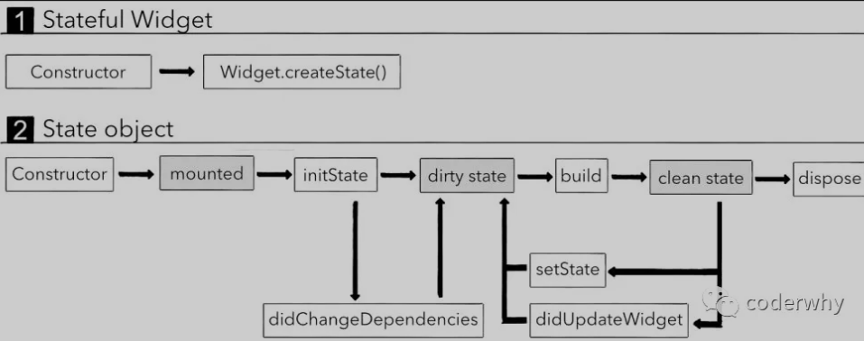

# Flutter

## 初体验

`flutter create learn_flutter`

HelloWorld:

```dart
import 'package:flutter/material.dart';

main(List<String> args) {
  runApp(Text("Hello World", textDirection: TextDirection.ltr));
}
```

`runApp(Widget app` 启动flutter 应用程序

Flutter中万物皆Widget

material脚手架:

```dart
import 'package:flutter/material.dart';

main(List<String> args) {
  runApp(
    MaterialApp(
      //脚手架
      home: Scaffold(
        appBar: AppBar(
          title: Text("CODERWHY"),
        ),
        body: Center(
          child: Text(
            "Hello World",
            textDirection: TextDirection.ltr,
            style: TextStyle(fontSize: 36),
          ),
        ),
      ),
    )
  );
}
```

- StatelessWidget： 没有状态改变的Widget，通常这种Widget仅仅是做一些展示工作而已；
- StatefulWidget： 需要保存状态，并且可能出现状态改变的Widget

**build方法被执行：**  
1、StatelessWidget第一次被插入到Widget树中时（第一次被创建时）；  
2、父Widget（parent widget）发生改变时，子Widget会被重新构建；  
3、如果Widget依赖InheritedWidget的一些数据，InheritedWidget数据发生改变时。

*SizedBox设置height属性，可用于占位* 

*BoxDorection 可用于设置border*

## StatefulWidget

[文章链接](https://mp.weixin.qq.com/s?__biz=Mzg5MDAzNzkwNA==&mid=2247483705&idx=1&sn=56693bb8b23f41757db48df93aae6866&chksm=cfe3f2c6f8947bd097f63f280de61f7b5634d71332f75679923ea4fceeb6f7c31885f0a26f77&scene=178&cur_album_id=1566028536430247937#rd)

一旦Widget中展示的数据发生变化，就重新构建整个Widget

```dart
@immutable
abstract class Widget extends DiagnosticableTree {
    // ...省略代码
}
```

被@immutable注解标明的类或者子类都必须是不可变的

**结论**： 定义到Widget中的数据一定是不可变的，需要使用final来修饰

创建StatefulWidget时必须创建两个类：

- 一个类继承自StatefulWidget，作为Widget树的一部分；
- 一个类继承自State，用于记录StatefulWidget会变化的状态，并且根据状态的变化，构建出新的Widget

如下：
当Flutter在构建Widget Tree时，会获取State的实例，并且它调用build方法去获取StatefulWidget希望构建的Widget；
那么，我们就可以将需要保存的状态保存在MyState中，因为它是可变的

```dart
class MyStatefulWidget extends StatefulWidget {
  @override
  State<StatefulWidget> createState() {
    // 将创建的State返回
    return MyState();
  }
}

class MyState extends State<MyStatefulWidget> {
  @override
  Widget build(BuildContext context) {
    return <BuildYourWidget>;
  }
}
```

**只要数据改变了Widget就需要重新构建（rebuild）**

###  生命周期

- 灰色部分是Flutter内部操作的，不需要手动去设置；
- 白色部分可以监听到或手动调用



- initState必须调用super
- didChangeDependencies调用场景
  1. initState调用
  2. 从其他对象中依赖一些数据发生改变时，比如InheritedWidget

## 编程范式

- 面向对象编程、面向过程编程、函数式编程、面向协议编程

- 命令式编程、声明式编程

  - 命令式编程：给计算机命令，告诉它我们想做什么事情
  - 声明式编程：描述目标的性质，当依赖的状态发生改变时，我们通过某些方式通知目标作出响应
