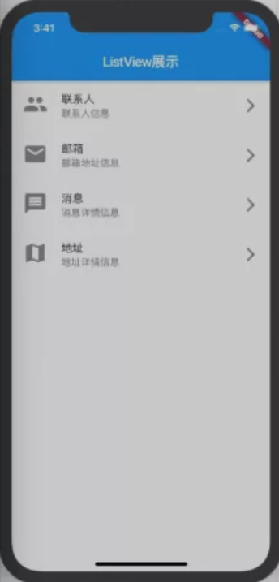

# Flutter

## 滚动Widget

[原文](https://mp.weixin.qq.com/s?__biz=Mzg5MDAzNzkwNA==&mid=2247483731&idx=1&sn=f27093de2ce635a25cdccf31696e8643&chksm=cfe3f2acf8947bbae17b96d75c667c3497acab719ec11397f970d4f48d9db2734da3ed1abd21&scene=178&cur_album_id=1566028536430247937#rd)

### JSON读取解析

#### JSON资源配置

1. 在assets中放置json文件，例如：`test.json`
2. 在`pubspec.yaml`中的assets标签下声明资源：`  - assets/test.json`

#### JSON读取解析

读取JSON资源使用`package:flutter/services.dart`中`rootBundle`的`loadString`方法

```dart
Future<String> loadString(String key, { bool cache = true}) async {
    ...
}
```

eg:

```dart
import 'package:flutter/services.dart' show rootBundle

rootBundle.loadString("assets/test.json").then((value) => print(value));
```

#### JSON字符串转换

可使用 `dart:convert` 包中的 `json.decode` 方法转化

eg:

```dart
//读取json
String jsonString = await rootBundle.loadString("assets/test.json");
//转成list或map
final jsonResult = json.decode(jsonString);
```

#### Model转换

定义Model

```dart
class Anchor {
    String nickName;
    String rootName;
    String imageUrl;

    Anchor({
        this.nickName,
        this.rootName,
        this.imageUrl
    });

    Anchor.withMap(Map<String, dynamic> parsedMap){
        this.nickName = parsedMap["nickName"];
        this.rootName = parsedMap["rootName"];
        this.imageUrl = parsedMap["imageUrl"];
    }
}
```

代码示例：

```dart
import'package:flutter/services.dart' show rootBundle;
import'dart:convert';
import'dart:async';

class Anchor {
  String nickname;
  String roomName;
  String imageUrl;

  Anchor({
    this.nickname,
    this.roomName,
    this.imageUrl
  });

  Anchor.withMap(Map<String, dynamic> parsedMap) {
    this.nickname = parsedMap["nickname"];
    this.roomName = parsedMap["roomName"];
    this.imageUrl = parsedMap["roomSrc"];
  }
}

Future<List<Anchor>> getAnchors() async {
  // 1.读取json文件
  String jsonString = await rootBundle.loadString("assets/yz.json");

  // 2.转成List或Map类型
  final jsonResult = json.decode(jsonString);

  // 3.遍历List，并且转成Anchor对象放到另一个List中
  List<Anchor> anchors = newList();
  for (Map<String, dynamic> map in jsonResult) {
    anchors.add(Anchor.withMap(map));
  }
  return anchors;
}
```

### ListView

沿水平或竖直方向排列子Widget

#### ListTile

用于左侧为图标，其后为标题和子标题，尾部有一图标

```dart
class MyHomeBody extends StatelessWidget {
    @override
    Widget build(BuildContext context) {
        return ListView(
            children: <Widget>[
                ListTile(
                    leading: Icon(Icons.people, size 36,),
                    title: Text("联系人"),
                    subtitle: Text("联系人信息"),
                    trailing: Icon(Icons.arrow_forward_ios),
                ),
                ListTile(
                    leading: Icon(Icons.email, size 36,),
                    title: Text("邮箱"),
                    subtitle: Text("邮箱地址信息"),
                    trailing: Icon(Icons.arrow_forward_ios),
                ),
                ListTile(
                    leading: Icon(Icons.message, size 36,),
                    title: Text("消息"),
                    subtitle: Text("消息详情信息"),
                    trailing: Icon(Icons.arrow_forward_ios),
                ),
                ListTile(
                    leading: Icon(Icons.map, size 36,),
                    title: Text("地址"),
                    subtitle: Text("地址详情信息"),
                    trailing: Icon(Icons.arrow_forward_ios),
                ),
            ]
        )
    }
}
```



#### 滚动

`scrollDirection` 控制视图滚动方向

需要给子Widget设置宽或高，或者使用`itemExtent`设置item占据范围

#### ListView.build

使用构造函数会一次性创建，会带来性能问题  

- itemBuilder : 创建列表，当滚动到对应位置，ListView自动调用该方法创建。 类型是IndexedWidgetBuilder 函数类型
- itemCount : 数量，空表示无限列表

```dart
class MyHomeBody extends StatelessWidget {
    @override
    Widget build(BuildContext context){
        return ListView.builder(
            itemCount: 100,
            itemExtent: 80,
            itemBuilder: (BuilderContext, int index) {
                return ListTile(title: Text("标题$index"), subtitle: Text("详细内容$index"));
            }
        );
    }
}
```

#### ListView.build 动态数据

使用 StatefulWidget

```dart
import 'model/anchor.dart';

//... losed many much

class MyHomeBody extends StatefulWidget {
  @override
  State<StatefulWidget> createState() {
      return MyHoneBodyState();
  }
}

class MyHomeBodyState extends State<MyHomeBody> {
    List<Anchor> anchors = [];

    //在初始化方法中加载数据
    @override
    void initState(){
        getAnchors().then((anchors){
            setState((){
                this.anchors = anchors;
            });
        });

        super.initState();
    }

    @override
    Widget build(BulidContext context) {
        return ListView.builer(
            itemBuilder: (BuilderContext context, int index){
                return Padding(
                    padding: EdgeInsets.all(8),
                    child: Column(
                        crossAxisAlignment: CrossAsixAligment.start,
                        children: <Widget>[
                            Image.network(
                                anchors[index].imageUrl,
                                //缩放模式
                                fit: BoxFit.fitWidth,
                                //屏幕宽度
                                width: MediaQuery.of(context).size.width,
                            ),
                            SizedBox(height: 8),
                            Text(anchors[index].nickName, style: TextStyle(fontSize: 20),),
                            SizedBox(height: 5),
                            Text(anchors[index].rootName)
                        ],
                    ),
                );
            }
        );
    }
}
```

#### ListView.separated

可生成列表项的分割器，比ListView.builder 多 `separatorBuilder` 参数

```dart
class MySeparatedDemo extends StatelessWidget {
    Divider blueDivider = Divider(color: Colors.blue);
    Divider redDivider = Divider(color: Colors.red);

    @override
    Widget build(BuildContext context) {
        return ListView.separated(
            itemBuilder: (BuildContext contect, int index) {
                return ListTail(
                    leading: Icon(Icons.people),
                    title: Text("联系人$index"),
                    subtitle: Text("联系人电话$index").
                );
            },
            separatorBuilder: (BuildContext context, int index) {
                //奇数行蓝色线，偶数行蓝色线
                return index % 2 ==0 ? redColor : blueColor;
            },
            itemCount: 100
        );
    }
}
```

### GridView

#### 构造函数创建

参数 `gridDelegate` 用于控制交叉轴的item数量或宽度，需要`SliverGridDelegate`,可使用子类：`SliverGridDelegateWithFixedCrossAsixCount`

```dart
SliverGridDelegatedWithFixedCrossAxisCount({
    @required double crossAsixCount,//交叉轴的item数量
    double mainAxisSpacing = 0.0,//主轴间距
    double crossAxisSpacing = 0.0,//交叉轴间距
    double childAspectRatio = 1.0,//子Widget的宽高比
})
```

PS：

也可使用`GridView.count`构造函数和`GridView.extent`构造函数实现对应的count和mainAxisSpacing的效果

```dart
class MyGridDemo extends StatelessWidget {
    List<Widget> getGridWidgets() {
        return List.generate(100, (index){
            return Container(
                color: Colors.purple,
                alignment: Alignment(0, 0),
                child: Text("item$index", style: TextStyle(fontSize: 20, color: Colors.white)),
            );
        });
    }

    @override
    Widget build(BuildContext context) {
        return GridView(
            gridDelegate: SliverGridDelegateWithFixedCrossAxisCount(
                crossAxisCount: 3,
                mainAxisSpacing: 10,
                crossAxisSpacing: 10,
                childAspectRatio: 1.0
            ),
            children: getGridWidgets(),
        );
    }
}
```

#### GridView.build

```dart
class _GridViewBuildDemoState extends State<GridViewBuildDemo> {
    List<Anchor> anchors = [];

    @override
    void initState() {
        getAnchors().then(anchors){
            setState((){
                this.anchors = anchors;
            });
        };
        super.initState();
    }

    @override
    Widget build(BuildContext context) {
        return Padding(
            padding: const EdgeInsets.all(8.0),
            child: GridView.builder(
                shrinkWrap: true,
                physics: ClampingScrollPhysics(),
                gridDelegate: SliverGridDelegateWithFixedCrossAxisCount(
                    corssAxisCount: 2,
                    mainAxisSpacing: 10,
                    crossAxisSpacing: 10,
                    childAspectRatio: 1.2,
                ),
                itemCount: anchor.length,
                itemBuilder: (BuildContext context, int index) {
                    return Container(
                        child: Column(
                            crossAxisAlignment: CrossAxisAlignment.start,
                            children: <Widget>[
                                Image.network(anchors[index].imageUrl),
                                SizedBox(height: 5),
                                Text(anchors[index].nickName, style: TextStyle(fontSize: 16),),
                                Text(anchors[index].roomName, maxLine: 1,overflow: TextOverflow.ellipsis,),
                            ],
                        ),
                    );
                },
            ),
        );
    }
}
```

### Slivers

`CustomScrollView` 统一管理滚动视图

其中每一个独立的可滚动的Widget就是`Sliver`

#### 基本使用

slivers:

- SliverList: 类似ListView
- SliverFixedExtentList: 类似SliverList，但可设置滚动高度
- SliverGrid: 类似GridView
- SliverPadding: 设置Sliver的内边距
- SliverAppBar: 添加AppBar，通常作为CustomScrollView的HeaderView
- SliverSafeArea: 设置内容显示在安全区域，如不让刘海遮住内容

```dart
class HomeContent extends StatelessWidget {
    @override
    Widget build(BuildContext context) {
        //实现效果为 2列橙色方块，
        return CustomScrollView(
            slivers: <Widget>[
                SliverSafeArea(
                    sliver: SliverPadding(
                        padding: EdgeInsets.all(8),
                        sliver: SliverGrid(
                            gridDelegate: SliverGridDelegateWithFixedCrossAxisCount(
                                crossAxisCount: 2,
                                crossAxisSpacing: 8,
                                mainAxisSpacing: 8,
                            ),
                            delegate: SliverChildBuilderDalegate(
                                (BuilderContext context, int index){
                                    return Container(
                                        alignment: Alignment(0, 0),
                                        color: Colors.orange,
                                        child: Text("item$index"),
                                    );
                                },
                                childCount: 20,
                            ),
                        ),
                    ),
                ),
            ],
        );
    }
}
```

#### 组合使用

```dart
class HomeContent extends StatelessWidget {
    @override
    Widget build(BuildContext context) {
        return showCustomScollView();
    }

    Widget showCustomScollView(){
        return CustomScrollView(
            sliver: <Widget>[
                    const SliverAppBar(
                        expandedHeight: 250.0,
                        flexibleSpace: FlexibleSpaceBar(
                            title: Text("demo"),
                            background: Image(
                                image: NetworkImage(
                                    "https://tva1.sinaimg.cn/large/006y8mN6gy1g72j6nk1d4j30u00k0n0j.jpg"
                                ),
                                fit: BoxFit.cover,
                            ),
                        ),
                    ),
                    SliverGrid(
                        grigDelegate: SliverGridDelagateWithMaxCrossAxisExtent(
                            maxCrossAxisExtent: 200.0,
                            mainAxisSpacing: 10.0,
                            corssAxisSpacing: 10.0,
                            childAspcetRatio: 4.0,
                        ),
                        delegate: SliverChildBuilderDelegate(
                            (BuilderContex contex ,int index){
                                return Container(
                                    alignment: Alignment.center,
                                    color: Colors.teal[100 * (index % 9)],
                                    child: Text("grid item $index"),
                                );
                            },
                            childCount: 10,
                        ),
                    ),
                    SliverFixedExtentList(
                        itemExtent: 50.0,
                        delegate: SliverChlidBuilderDelegate(
                            (BuilderContext context, int index){
                                return Container(
                                    alignment: Alignment.center,
                                    color: Colors.lightBlue[100 * (index % 9)],
                                    child: Text("list item $index"),
                                );
                            },
                            itemCount: 20,
                        ),
                    ),
                ),
            ],
        );
    }
}
```

### 滚动监听

`ScrollController`
`ScrollNotification`

#### ScrollController

渲染到屏幕的元素是`RenderObject`

ListView、GridView的控制器是ScrollController，可获取滚动信息，可更新滚动位置

使用ScrollController和StatefulWidget一起使用，根据位置改变状态，控制初始化、监听
销毁事件

Demo:

滚动到1000时显示回到顶部按钮

- `jumpTo(double offset)`、`animateTo(double offset, ...)` 用于跳转到指定位置，后者会指定动画
- ScrollController继承自Listenable，可监听滚动事件

```dart
class MyHomePage extends StatefulWidget {
    @override
    State<StatefulWidget> createState() => MyHomePageState();
}

class MyHomePageState extends State<MyHomePage> {
    ScrollController _controller;
    bool _isShowTop = false;

    @override
    void initState(){
        //初始化controller
        _controller = ScrollController();

        //滚动监听
        _controller.addListener(() {
            var tempSsShowTop = _controller.offset >= 1000;
            if(tempSsShowTop != _isShowTop) {
                setState((){
                    _isShosTop = tempSsShowTop;
                });
            }
        });
        super.initState();
    }

    @override
    Widget build(BuildContext context) {
        return Scaffold(
            appBar: AppBar(
                title: Text("ListView展示")
            ),
            body: ListView.builder(
                itemCount: 100,
                itemExtent: 60,
                controller: _controller,
                itemBuilder: (BuilderContext context, int index){
                    return ListTile(title: Text("item $index"));
                },
            ),
            floatinhActionButton: !_isShowTop ? null : FloatingActionButton(
                child: Icon(Icons.arrow_upward),
                onPressed: (){
                    _controller.animatedTo(0, duration: Duration(milloseconds: 1000), curve: Curve.ease);
                },
            ),
        );
    }
}
```

#### NotificationListener

监听开始滚动与结束滚动

- NotificationListener是Widget，模板参数T指定监听类型，如果省略会收到所有类型监听
- NotificationListener需要onNotification回调函数，返回Boolean代表是否阻止事件继续传递

```dart
class MyHomeNotificationDemo extends StatefulWidget {
    @override
    State<StatefulWidget> createState() => MyHomeNotificationDemoState();
}

class MyHomeNotificationDemoState extends State<MyHomeNotificationDemo> {
    int _progress = 0;

    @override
    Widget build(BuildContext context) {
        return NotificationListener(
            onNotification: (ScrollNotification notification) {
                //判断监听事件的类型
                if(notification is ScrollStartNotification){
                    print("开始滚动....");
                } else if(notification is ScrollUpdateNotification) {
                    // 当前滚动的位置和总长度
                    final currentPixel = notification.metrics.pixels;
                    final totalPixel = notification.metrics.maxScrollExtent;
                    double progress = currentPixel / totalPixel;
                    setState((){
                        _progress = (progress * 100).toInt();
                    });
                    print("正在滚动 $currentPixel / $totalPicel");
                } else if (notification is ScrollEndNotification) {
                    print("结束滚动...");
                }
                return false;
            },
            child: Stack(
                alignment: Alignment(.9, .9),
                chidren: <Widget>[
                    ListView.builder(
                        itemCount: 100,
                        itemExtent: 60,
                        itemBuilder: (BuildContext contex, int index){
                            return ListTile(title: Text("item $index"));
                        }
                    ),
                    CircleAvatar(
                        radius: 30,
                        child: Text("$_progress%"),
                        backgroundColor: Colors.black54,
                    )
                ],
            ),
        );
    }
}
```
