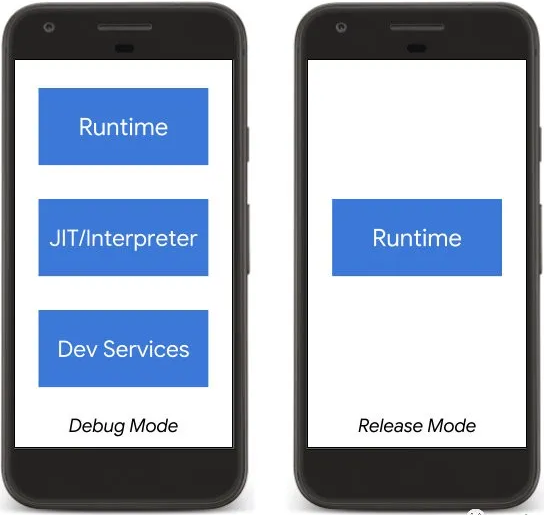
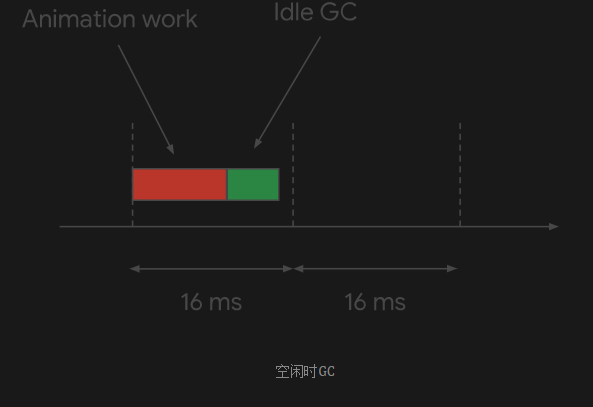
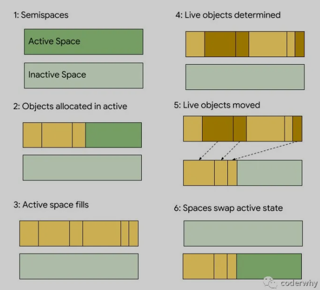

# Flutter

## 你不必担心Dart的垃圾回收器

[参考文章](https://mp.weixin.qq.com/s?__biz=Mzg5MDAzNzkwNA==&mid=2247483777&idx=1&sn=4bb215e0321e70cd1e80ef72c48260de&chksm=cfe3f27ef8947b683737ecbc7eacc21b1f69a6d2c182a24ce2ffc0a5934c3c209e1e53c39109&scene=178&cur_album_id=1566028536430247937#rd)

Widget只是最终渲染对象（RenderObject）的配置文件，它会在build的时候频繁的销毁和创建.

Dart针对Flutter的Widget的创建和销毁专门做过优化，这也是Flutter在多种语言中选择Dart的一个重要因素,我们不需要担心他的创建和销毁带来的性能问题.

原文地址：https://medium.com/flutter/flutter-dont-fear-the-garbage-collector-d69b3ff1ca30

Flutter使用Dart作为开发语言和运行时机制，Dart一直保留着运行时机制，无论是在调试模式（debug）还是发布模式（release），但是两种构建方式之间存在很大的差异。

在调试模型下，Dart将所有的管道（需要用到的所有配件）全部装载到设备上：运行时，JIT（the just-in-time）编译器/解释器（JIT for Android and interpreter for iOS），调试和性能分析服务。
在发布模式下，会除去JIT编译器/解释器依然保留运行时，因为运行时是Flutter App的主要贡献者。

Dart的运行时包括一个非常重要的组件：垃圾回收器，它主要的作用就是分配和释放内存，当一个对象被实例化（instantiated）或者变成不可达（unreachable）。

在Flutter运行过程中，会有很多的Object。

- 在StatelessWidget在渲染前（其实上还有StatefulWidget），他们被创建出来。
- 当状态发生变化的时候，他们又会被销毁。
- 事实上，他们有很短的寿命（lifespan）。
- 当我们构建一个复杂的UI界面时，会有成千上万这样的Widgets

担心垃圾回收器不能很好的帮助我们管理这些

- 当Flutter频繁的创建和销毁这些Widget（Objects），我们是否需要很迫切的限制这种行为呢？
- 非常普遍，对于新的Flutter开发者来说，当一个Widget的状态不需要改变时，他们会创建引用的Widget，来替代State中的Widget，以便于不会被销毁或者重建。

**不需要这样做**

担心Dart的GC是没有任何事实根据的（没有必要），这是因为它分代（generational）架构和实现，可以让我们频繁创建和销毁对象有一个最优解。在大多数情况下，我们只需要Flutter引擎按照它的方式创建和销毁这些Widgets即可。

### Dart的GC

Dart的GC是分代的（generational）和由两个阶段构成：the young space scavenger（scavenger针对年轻一代进行回收） and parallel mark sweep collectors（sweep collectors针对老一代进行回收）

注：V8引擎也是这样的机制

#### 调度安排（Scheduling）

为了让RG最小化对App和UI性能的影响，GC对Flutter引擎提供了hooks，hooks被通知，当Flutter引擎被侦测到这个App处于闲置的状态，并且没有用户交互的时候。这就给了GC一个空窗期来运行它的手机阶段，并且不会影响性能。

垃圾收集器还可以在那些空闲间隔内进行滑动压缩（sliding compaction），从而通过减少内存碎片来最大程度地减少内存开销。

#### 阶段一：Young Space Scavenger

这个阶段主要是清理一些寿命很短的对象，比如StatelessWidget。当它处于阻塞时，它的清理速度远快于第二代的mark、sweep方式。并且结合调度，完成可以消除程序运行时的暂停现象。

本质上来讲，对象在内存中被分配一段连续的、可用的内存空间，直接被分配完为止。Dart使用bump pointer（注解：如果像malloc一样，维护free_list再分配，效率很低。）分配新的空间，处理过程非常快。

分配了新对象的新空间，被为两部分，称之为semi spaces。一部分处于活动状态，另一部分处于非活动状态。新对象分配在活动状态，一旦填充完毕，依然存活的Object，就会从活动状态copy到非活动状态，并且清除死亡的Object。这个时候非活动状态变成了活动状态，上面的步骤一次重复。（注解：GC来完成上面的步骤）

为了确定哪些Object是存活的或死亡的，GC从根对象开始检测它们的应用。然后将有引用的Object（存活的）移动到非活动状态，直接所有的存活Object被移动。死亡的Object就被留下；

有关此的更多信息，请查看Cheney算法。

#### 阶段二：Parallel Marking and Concurrent Sweeping

当对象达到一定的寿命（在第一阶段没有被GC回收），它们将被提升由第二代收集器管理的新内存空间：mark-sweep。

这个阶段的GC有两个阶段：第一阶段，首先遍历对象图（the object graph），然后标记正在使用的对象。第二阶段，将扫描整个内存，并且回收所有未标记的对象。

这种GC机制在标记阶段会阻塞，不能有内存变化、UI线程也会被阻塞。但是由于短暂的对象在Young Space Scavenger阶段以及被处理，所有这个阶段非常少出现。不过由于Flutter可以调用收集时间，影响的性能也会被降到最低。

但是如果引用程序不遵守分代的机制，反而这种情况会经常发生。但是由于Flutter的Widget的机制，所有这种情况不经常发生，但是我们还是需要了解这种机制。

### Isolate

值得注意的是，Dart中的Isolate机制具有私有堆的概念，彼此是独立的。每个Isolate有自己单独的线程来运行，每个Isolate的GC不影响其他线程的性能。使用Isolate是避免阻塞UI和减轻密集型任务的好方法（注解：耗时操作可以使用Isolate）。

### 总结

Dart使用了强大的分代GC，以最大限度的减少Flutter中GC带来的性能影响。

所以，你不需要担心Dart的垃圾回收器，这个反而是我们应用程序的核心所在。
