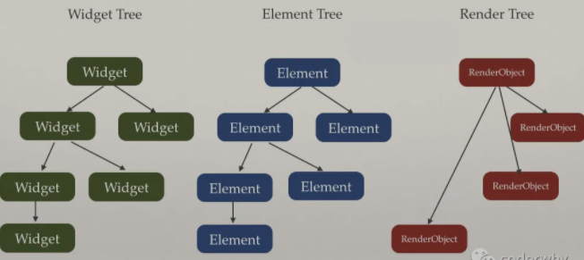
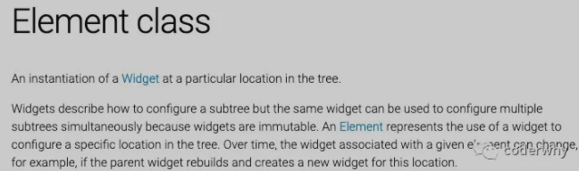
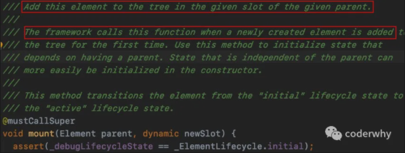
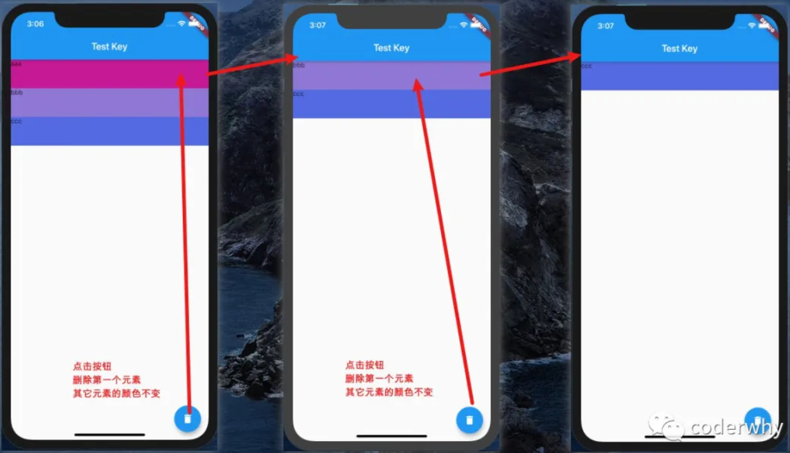

# Flutter

## Widget-Element-RenderObject

[参考文章](https://mp.weixin.qq.com/s?__biz=Mzg5MDAzNzkwNA==&mid=2247483782&idx=1&sn=5cca87b95f82131ed0052d935f907807&chksm=cfe3f279f8947b6f9a21b92d7c5084e9404993ccce3c80f6329c0734f037f89d1d859651616f&scene=178&cur_album_id=1566028536430247937#rd)

### Flutter 渲染流程

#### 1.1 Widget-Element-RenderObject 关系



#### 1.2 Widget是什么


官方对Widget的说明：

- Flutter的Widgets的灵感来自React，中心思想是构造你的UI使用这些Widgets。
- Widget使用配置和状态，描述这个View（界面）应该长什么样子。
- 当一个Widget发生改变时，Widget就会重新build它的描述，框架会和之前的描述进行对比，来决定- 使用最小的改变（minimal changes）在渲染树中，从一个状态到另一个状态。

理解：

- Widget就是一个个描述文件，这些描述文件在我们进行状态改变时会不断的build。
- 但是对于渲染对象来说，只会使用最小的开销来更新渲染界面。

#### 1.3 Element是什么



官方对Element的描述：

- Element是一个Widget的实例，在树中详细的位置。
- Widget描述和配置子树的样子，而Element实际去配置在Element树中特定的位置。

#### 1.4 RenderObject

官方对RenderObject的描述：

- 渲染树上的一个对象
- RenderObject层是渲染库的核心

### 对象的创建过程

以Padding为例

#### 2.1 Widget

Padding是一个Widget，并且继承自SingleChildRenderObjectWidget

继承关系如下：

```txt
Padding -> SingleChildRenderObjectWidget -> RenderObjectWidget -> Widget
```

我们之前在创建Widget时，经常使用StatelessWidget和StatefulWidget，这种Widget只是将其他的Widget在build方法中组装起来，并不是一个真正可以渲染的Widget

在Padding的类中，我们找不到任何和渲染相关的代码，这是因为Padding仅仅作为一个配置信息，这个配置信息会随着我们设置的属性不同，频繁的销毁和创建

频繁的销毁和创建会不会影响Flutter的性能呢？

并不会，[参考:你不必担心Dart的垃圾回收器](./8.%20flutter_learn_gc.md)

#### 2.2 RenderObject

我们来看Padding里面的代码，有一个非常重要的方法：

这个方法其实是来自RenderObjectWidget的类，在这个类中它是一个抽象方法；  
抽象方法是必须被子类实现的，但是它的子类SingleChildRenderObjectWidget也是一个抽象类，所以可以不实现父类的抽象方法  
但是Padding不是一个抽象类，必须在这里实现对应的抽象方法，而它的实现就是下面的实现

```dart
@override
RenderPadding createRenderObject(BuildContext context) {
  return RenderPadding(
    padding: padding,
    textDirection: Directionality.of(context),
  );
}
```

上面的代码创建了什么呢？RenderPadding

RenderPadding的继承关系是什么呢？

```txt
RenderPadding -> RenderShiftedBox -> RenderBox -> RenderObject
```

我们来具体查看一下RenderPadding的源代码：

如果传入的_padding和原来保存的value一样，那么直接return；  
如果不一致，调用_markNeedResolution，而_markNeedResolution内部调用了markNeedsLayout；
而markNeedsLayout的目的就是标记在下一帧绘制时，需要重新布局performLayout；  
如果我们找的是Opacity，那么RenderOpacity是调用markNeedsPaint，RenderOpacity中是有一个paint方法的；

```dart
set padding(EdgeInsetsGeometry value) {
    assert(value != null);
    assert(value.isNonNegative);
    if (_padding == value)
      return;
    _padding = value;
    _markNeedResolution();
  }
```

#### 2.3 Element

我们来思考一个问题：

之前我们写的大量的Widget在树结构中存在引用关系，但是Widget会被不断的销毁和重建，那么意味着这棵树非常不稳定；  
那么由谁来维系整个Flutter应用程序的树形结构的稳定呢？  
答案就是Element。  
官方的描述：Element是一个Widget的实例，在树中详细的位置

Element什么时候创建？  
在每一次创建Widget的时候，会创建一个对应的Element，然后将该元素插入树中。

Element保存着对Widget的引用；  
在SingleChildRenderObjectWidget中，我们可以找到如下代码：

- 在Widget中，Element被创建，并且在创建时，将this（Widget）传入了；
- Element就保存了对Widget的应用；

```dart
@override
  SingleChildRenderObjectElement createElement() => SingleChildRenderObjectElement(this);
```

在创建完一个Element之后，Framework会调用mount方法来将Element插入到树中具体的位置：



在调用mount方法时，会同时使用Widget来创建RenderObject，并且保持对RenderObject的引用：

- _renderObject = widget.createRenderObject(this);

```dart
@override
  void mount(Element parent, dynamic newSlot) {
    super.mount(parent, newSlot);
    _renderObject = widget.createRenderObject(this);
    assert(() {
      _debugUpdateRenderObjectOwner();
      returntrue;
    }());
    assert(_slot == newSlot);
    attachRenderObject(newSlot);
    _dirty = false;
  }
```

但是，如果你去看类似于Text这种组合类的Widget，它也会执行mount方法，但是mount方法中并没有调用createRenderObject这样的方法。

- 我们发现ComponentElement最主要的目的是挂载之后，调用_firstBuild方法

```dart
@override
  void mount(Element parent, dynamic newSlot) {
    super.mount(parent, newSlot);
    assert(_child == null);
    assert(_active);
    _firstBuild();
    assert(_child != null);
  }

  void _firstBuild() {
    rebuild();
  }
```

如果是一个StatefulWidget，则创建出来的是一个StatefulElement

我们来看一下StatefulElement的构造器：

- 调用widget的createState()
- 所以StatefulElement对创建出来的State是有一个引用的
- 而_state又对widget有一个引用

```dart
  StatefulElement(StatefulWidget widget)
      : _state = widget.createState(),
  //....省略代码
  _state._widget = widget;
```

而调用build的时候，本质上调用的是_state中的build方法：

```dart
Widget build() => state.build(this);
```

#### 2.4 build中的context是什么

在StatelessElement中，我们发现是将this传入，所以本质上BuildContext就是当前的Element

```dart
Widget build() => widget.build(this);
```

我们来看一下继承关系图：

- Element是实现了BuildContext类（隐式接口）

```dart
abstractclass Element extends DiagnosticableTree implements BuildContext
```

在StatefulElement中，build方法也是类似，调用state的build方式时，传入的是this

```dart
Widget build() => state.build(this);
```

#### 2.5 创建过程小结

Widget只是描述了配置信息：

- 其中包含createElement方法用于创建Element
- 也包含createRenderObject，但是不是自己在调用
- Element是真正保存树结构的对象：

创建出来后会由framework调用mount方法；

- 在mount方法中会调用widget的createRenderObject对象；
- 并且Element对widget和RenderObject都有引用；
- RenderObject是真正渲染的对象：

其中有`markNeedsLayout` `performLayout` `markNeedsPaint` `paint`等方法

### Widget的Key

#### 3.1 案例需求



home 界面基本代码

```dart
class _HYHomePageState extends State<HYHomePage> {
  List<String> names = ["aaa", "bbb", "ccc"];

  @override
  Widget build(BuildContext context) {
    return Scaffold(
      appBar: AppBar(
        title: Text("Test Key"),
      ),
      body: ListView(
        children: names.map((name) {
          return ListItemLess(name);
        }).toList(),
      ),

      floatingActionButton: FloatingActionButton(
        child: Icon(Icons.delete),
        onPressed: () {
          setState(() {
            names.removeAt(0);
          });
        }
      ),
    );
  }
}
```

#### 3.2 StatelessWidget实现

```dart
class ListItemLess extends StatelessWidget {
  finalString name;
  final Color randomColor = Color.fromARGB(255, Random().nextInt(256), Random().nextInt(256), Random().nextInt(256));

  ListItemLess(this.name);

  @override
  Widget build(BuildContext context) {
    return Container(
      height: 60,
      child: Text(name),
      color: randomColor,
    );
  }
}
```

它的实现效果是每删除一个，所有的颜色都会发现一次变化

- 删除之后调用setState，会重新build，重新build出来的新的StatelessWidget会重新生成一个新的随机颜色

#### 3.3 使用StatefulWidget实现（无key）

```dart
class ListItemFul extends StatefulWidget {
  finalString name;
  ListItemFul(this.name): super();
  @override
  _ListItemFulState createState() => _ListItemFulState();
}

class _ListItemFulState extends State<ListItemFul> {
  final Color randomColor = Color.fromARGB(255, Random().nextInt(256), Random().nextInt(256), Random().nextInt(256));

  @override
  Widget build(BuildContext context) {
    return Container(
      height: 60,
      child: Text(widget.name),
      color: randomColor,
    );
  }
}
```

颜色不变化，但是数据向上移动了

- 这是因为在删除第一条数据的时候，Widget对应的Element并没有改变；
- 而Element中对应的State引用也没有发生改变；
- 在更新Widget的时候，Widget使用了没有改变的Element中的State；

#### 3.4 使用StatefulWidget实现（随机key）

ListItemFul修改为如下：

```dart
class ListItemFul extends StatefulWidget {
  finalString name;
  ListItemFul(this.name, {Key key}): super(key: key);
  @override
  _ListItemFulState createState() => _ListItemFulState();
}
```

home修改如下：

```dart
body: ListView(
  children: names.map((name) {
    return ListItemFul(name, key: ValueKey(Random().nextInt(10000)),);
  }).toList(),
),
```

每次删除都会出现随机颜色的现象

- 因为修改了key之后，Element会强制刷新，那么对应的State也会重新创建

```dart
// Widget类中的代码
static bool canUpdate(Widget oldWidget, Widget newWidget) {
  return oldWidget.runtimeType == newWidget.runtimeType
    && oldWidget.key == newWidget.key;
}
```

#### 3.5 StatefulWidget实现（name为key）

```dart
body: ListView(
  children: names.map((name) {
    return ListItemFul(name, key: ValueKey(name));
  }).toList(),
),
```

- 因为这是在更新widget的过程中根据key进行了diff算法
- 在前后进行对比时，发现bbb对应的Element和ccc对应的Element会继续使用，那么就会删除之前aaa对应的Element，而不是直接删除最后一个Element

### Key分类

Key本身是一个抽象，不过它也有一个工厂构造器，创建出来一个ValueKey

直接子类主要有：LocalKey和GlobalKey

- LocalKey，它应用于具有相同父Element的Widget进行比较，也是diff算法的核心所在；
- GlobalKey，通常我们会使用GlobalKey某个Widget对应的Widget或State或Element

#### 3.6.1 LocalKey

LocalKey有三个子类

- ValueKey
  ValueKey是当我们以特定的值作为key时使用，比如一个字符串、数字等等
- ObjectKey
  如果两个学生，他们的名字一样，使用name作为他们的key就不合适了我们可以创建出一个学生对象，使用对象来作为key
- UniqueKey
  如果我们要确保key的唯一性，可以使用UniqueKey

#### 3.6.2 GlobalKey

GlobalKey可以帮助我们访问某个Widget的信息，包括Widget或State或Element等对象

我们来看下面的例子：我希望可以在HYHomePage中直接访问HYHomeContent中的内容

```dart
class HYHomePage extends StatelessWidget {
  final GlobalKey<_HYHomeContentState> homeKey = GlobalKey();

  @override
  Widget build(BuildContext context) {
    return Scaffold(
      appBar: AppBar(
        title: Text("列表测试"),
      ),
      body: HYHomeContent(key: homeKey),
      floatingActionButton: FloatingActionButton(
        child: Icon(Icons.data_usage),
        onPressed: () {
          print("${homeKey.currentState.value}");
          print("${homeKey.currentState.widget.name}");
          print("${homeKey.currentContext}");
        },
      ),
    );
  }
}

class HYHomeContent extends StatefulWidget {
  finalString name = "123";

  HYHomeContent({Key key}): super(key: key);

  @override
  _HYHomeContentState createState() => _HYHomeContentState();
}

class _HYHomeContentState extends State<HYHomeContent> {
  finalString value = "abc";

  @override
  Widget build(BuildContext context) {
    return Container();
  }
}
```