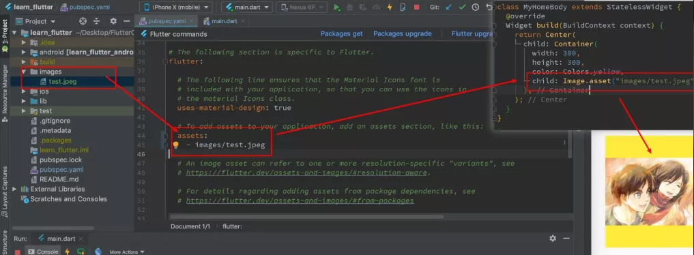

# Flutter

## 基础Widget

### 文本

#### 普通文本

- 布局参数：textAlign、textDirection、maxLines、overflow（截断规则）、textScaleFactor（缩放），在构造函数中
- 样式参数：fontFamily、fontSize、color、shadows，在style中

#### 富文本

TextSpan

TextSpan的children再放置TextSpan即可

### 按钮

- FloatingActionButton
- RaisedButton
- FlatButton
- OutlineButton（边框）

```dart
color：Colors.orange,//按钮颜色
hightlightColor：Colors.orange[700],//按下高亮色
shape：RoundedRectangleBorder(borderRadius: BorderRadius.circular(20)),//圆角
onPressed:(){
  print("按钮被按了");
}
```

elevation:阴影大小

### 图片

构造函数

- Image.assets:加载本地资源图片
- Image.network:加载网络图片

```dart
const Image({
  ...,
  this.width,//宽
  this.height,//高
  this.color,//混合色值
  this.colorBlendMode,//混合模式
  this.fit,//缩放模式，fill、cover、contain、fitWidth、fitHeigh
  this.alignment = Alignment.center,//对齐方式
  this.repeat = ImageRepeat.noRepeat,//重复模式
  ...
})
```

#### 加载本地图片



#### 圆形图片

- 方式1 CircleAvatar

```dart
const CircleAvatar({
  Key key,
  this.child,//子widget
  this.backgroundColor,//背景色
  this.backgroundImage,//背景图片
  this.foregroundColor,//前景色
  this.radius,//半径
  this.minRadius,//最小半径
  this.maxRadius,//最大半径
})
```

此处的backgroundImage是个ImageProvider，可使用NetworkImage或AssetsImage

```dart
class HomeContent extends StatalessWidget {
  @override
  Widget build(BuildContext context){
    return Center(
      child: CircleAvatar(
        radius: 100,
        backgroundImage: NetworkImage("imageurl"),
        child: Container{
          alignment : Alignment(0,.5),
          width: 200,
          height: 200,
          child: Text("这是头像"),
        },
      ),
    );
  }
}
```

- 方式2 ClipOval

ClipOval仅可用于圆形头像

```dart
class HomeContent extends StatelessWidget{
  @override
  Widget build(BuildContext context) {
    return Center(
      child: ClipOval(
        child:  Image.network(
          "url",
          width: 200,
          height: 200,
        )
      )
    );
  }
}
```

- 方式3 Container+BoxDecoration

#### 圆角图片

- 方式1 ClipRRect

```dart
class HomeContent extends StatelessWidget {
  @override
  Widget build(BuildContext context){
    return Center(
      child: ClipRRect(
        borderRadius: BorderRadius.circular(10),
        child: Image.network(
          "url",
          width: 200,
          height: 200,
        )
      )
    );
  }
}
```

- 方式2 Container+BoxDecoration

### 表单Widget

#### TextField

``` dart
const TextField({
  Key key,
  this.controller,
  this.focusNode,
  this.decoraition = const InputDecoration(),//设置输入框样式
  TextInputType keybroadType,//键盘类型
  this.textInputAction,
  this.textCapitalization = Textcapitalization.none,
  this.style,//样式
  this.structStyle,
  this.textAlign = TextAlign.start,//文本对齐方式
  this.textAlignVertical,
  this.textDirection,
  this.readOnly = false,
  ToolbarOptions toolbarOptions,
  this.showCursor,
  this.autofocus = true,
  this.obscureText = false,
  this.autocorrect = true,
  this.maxLines = 1,
  this.minLines,
  this.expands = false,
  this.maxLength,
  this.maxLengthEnforced = true,
  this.onChanged,//监听输入，传入回调函数
  this.onEditingComplete,
  this.onSubmitted,
  this.inputFormatters,
  this.enabled,
  this.cursorWidth = 2.0,
  this.cursorRadius,
  this.cursorColor,
  this.keyboardAppearance,
  this.scrollPadding = const EdgeInsets.all(20.0),
  this.dragStartBehavior = DragStartBehavior.start,
  this.enableInteractiveSelection = true,
  this.onTap,
  this.buildCounter,
  this.scrollController,
  this.scrollPhysics,
})
```

demo:

```dart
return TextField(
  decoration: InputDecoration(
    icon: Icon(Icons.people),
    lableText: "username",
    hintText: "请输入用户名",
    border: InputBorder.none,
    filled: true,
    fillColor: Colors.lightGreen
  ),
  onChanged: (value){
    print("onChanged:$value");
  },
  onSubmitted: (value){
    print("onSubmittted:$value");
  },
);
```

可使用TextEditingController设置初始值，监听文本变化。
如果未手动提供controller，会默认创建

```dart
class _TextFoeldDemoState extends State<TextFieldDemo> {
  final textEditingController = TextEditingController()

  @override
  void initState();

  // 设置默认值
  textEditingController.text = "Hello world";

  //监听文本
  textEditingController.addListener(() {
    print("textEditingController:${textEditingController.text}")
  });

  //...
}
```
