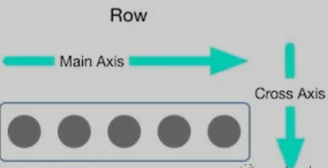
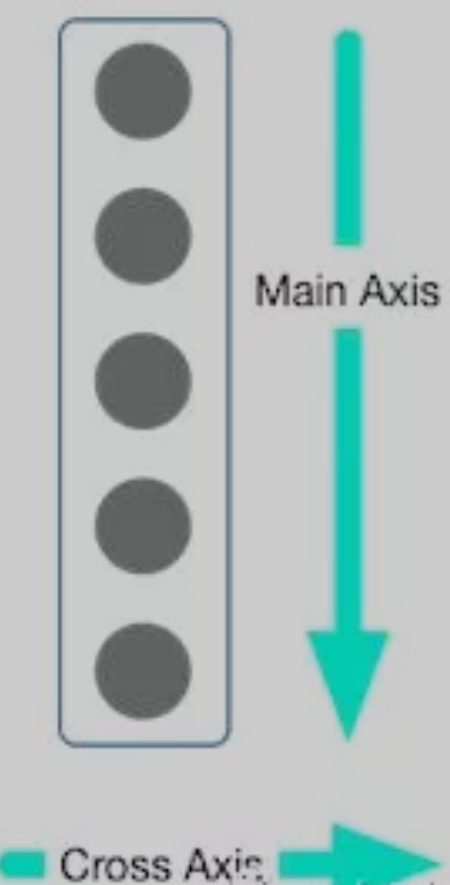

# Flutter

## 布局Widget

### 单子布局Widget

#### Align

```dart
const Align({
  Key key,
  this.alignment: Alignment.center, // 对齐方式，默认居中对齐
  this.widthFactor, // 宽度因子，不设置的情况，会尽可能大
  this.heightFactor, // 高度因子，不设置的情况，会尽可能大
  Widget child // 要布局的子Widget
})
```

说明：

1. 子Widget在父Widget中的对其方式要求父Widget有自己的宽高
2. widthFactor及heightFactor如果有值，Align的宽\高会是子Widget的widthFactor\heightFactor倍
3. 如果factor参数不设置，Align宽高会尽可能大

#### Center

Center继承自Align，alignment为ALignment.center

#### Padding

```dart
const Padding({
  Key key,-
  @requiredthis.padding, // EdgeInsetsGeometry类型（抽象类），使用EdgeInsets
  Widget child,
})
```

#### Container

```dart
Container({
  this.alignment,
  this.padding, //容器内补白，属于decoration的装饰范围
  Color color, // 背景色
  Decoration decoration, // 背景装饰
  Decoration foregroundDecoration, //前景装饰
  double width,//容器的宽度
  double height, //容器的高度
  BoxConstraints constraints, //容器大小的限制条件
  this.margin,//容器外补白，不属于decoration的装饰范围
  this.transform, //变换
  this.child,
})
```

说明：

1. 大小可以用 `width`、`height`或`constraints`. `width`、`height`如果有值，会生成`constrains`覆盖`constrains`属性
2. `color`与`decoration`互斥，`color`会产生`decoration`

#### BoxDecoration

```dart
const BoxDecoration({
    this.color, // 颜色，会和Container中的color属性冲突
    this.image, // 背景图片
    this.border, // 边框，对应类型是Border类型，里面每一个边框使用BorderSide
    this.borderRadius, // 圆角效果
    this.boxShadow, // 阴影效果
    this.gradient, // 渐变效果
    this.backgroundBlendMode, // 背景混合
    this.shape = BoxShape.rectangle, // 形变
  })
```

#### Demo

圆角图像

```dart
return Center(
    child: Container(
        width: 200,
        height: 200,
        decoration: BoxDecoration(
            borderRadius: BorderRadius.circular(20),
            image: DecorationImage(
                image: NetworkImage("url"),
            )
        ),
    ),
);
```

### 多子布局组件

#### Flex

Flex 当 direction 为Axis为Axis.horizontal 时，是Row
Flex 当 direction 为Axis为Axis.vertical 时，是Column

主轴（Main Axis）  
交叉轴（Cross Axis)





#### Row

行布局

```dart
Row({
 Key key,
 MainAxisAlignment mainAxisAlignment = MainAxisAlignment.start,//主轴对齐方式
 MainAxisSize manAxisSize = MainAxisSIze.max,//水平方向尽可能大
 CrossAxisAlignment corssAxisAlignment = CorssAxisAlignment.center,//交叉处理方式
 TextDirection textDirection，//水平方向子Widget的布局顺序（默认为系统当前Locale环境的文本方向）
 VerticalDirection verticalDirection = VerticalDirection.down,//表示row纵轴（垂直）的对齐方向
 TextBaseline textBaseLine,//如果上面是baseline对齐方式，那么选择何种模式（两种可选）
 List<Widget> children = const <Widget>[],
})
```

- textDirection的值为TextDirection.ltr，则alignment的start代表左，end代表右
- textDirection的值为TextDirection.rtl，则alignment的start代表右，end代表左

#### Expended

将剩余的空间根据Expended的flex系数进行分配

#### Column

```dart
Column({
  Key key,
  MainAxisAlignment mainAxisAlignment = MainAxisAlignment.start,
  MainAxisSize manAxisSize = MainAxisSIze.max,
  CrossAxisAlignment corssAxisAlignment = CorssAxisAlignment.center,
  TextDirection textDirection，
  VerticalDirection verticalDirection = VerticalDirection.down,
  TextBaseline textBaseLine,
  List<Widget> children = const <Widget>[],
})
```

#### Stack

层叠布局

```dart
Stack({
  Key key,
  this.alignment = AlignmentDirectional.topstart,
  this.textDirection,
  this.fit = StackFit.loose,
  this.overflow = Overflow.clip,
  List<Widget> children = const <Widget>[],
})
```

- alignment 参数决定没有被定位（Positioned)或被部分定位的子Widget的对齐方式
- fit 决定没有定位的子Widget如何适应Stack大小
  - StackFit.loose 使用子Widget的大小
  - StackFit.expand 扩展到Stack的大小
- overflow
  - Overflow.clip 超出裁剪
  - Overflow.visiblie 超出显示
