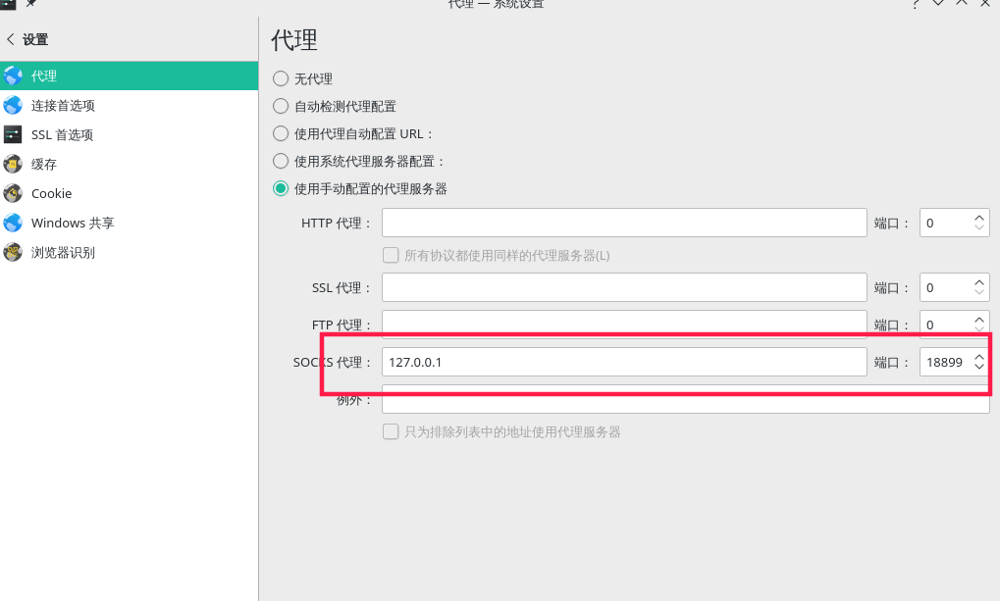
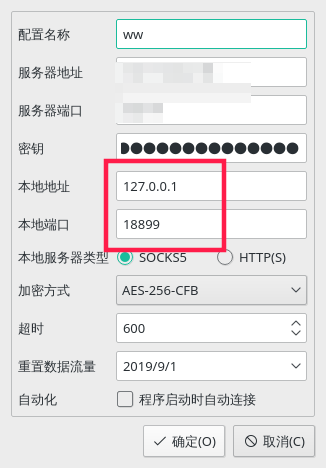

# manjaro折腾笔记

https://www.4gml.com/thread-94.htm

https://www.jianshu.com/p/21c39bc4dd31

<b>注：</b>据说刻录镜像的时候选择raw，而不是选择hdd+

### 关于软件源

用于设置源，此设置影响源的访问速度
```bash
pacman-mirrors -i -c China -m rank
```

用于设置软件包的源，此设置增加指定源的软件包
```bash
sudo vim /etc/pacman.conf
#添加如下内容
[archlinuxcn]
SigLevel = Optional TrustedOnly
Server = https://mirrors.ustc.edu.cn/archlinuxcn/$arch
```
- 注意：配置玩之后惊醒系统更新，否则有些老的库会影响会影响一下软件的安装

[源相关地址](https://mirrors.ustc.edu.cn/help/manjaro.html)

[安装deb包教程](https://www.jianshu.com/p/21bc10811b78)

[一些软件](https://www.cnblogs.com/starxi/p/11098263.html)

需要安装的软件
- 在上述教程中安装输入法 要软不安装成功！！！
- sudo pacman -S yaourt
- sudo pacman -S yay
- trash-cli  # 模拟回收站，防止暴力的rm，与桌面的回收站兼容
  ```bash
  #安装
    git clone https://github.com/emanon-was/trash-cli.git
  #解压
  #配置环境变量，在/etc/profile.d/目录下新建文件 trash-cli-master.sh
  #set trash-cli environment
  PATH=/home/jsongo/softwawres/trash-cli-master/bin:$PATH
  export PATH
  #保存后，生效配置
  source /etc/profile.d/trash-cli-master.sh

  #在用户中替换rm
  vim ～/.bashrc
  # 添加如下内容
  source /etc/profile.d/trash-cli-master.sh
  alias rm='trash-put'
  alias trash='trash-list'
  alias trashr='trash-restore'
  #保存后
  source ～./bashrc

  ```

- yay -S wewechat 
- yaourt -S deepin-wine-tim
- sudo pacman xorg-xbacklight #调节亮度
- svn
    ```bash
    #安装svn
    sudo pacman -S svn

    #checkout操作指令
    svn co http://xxxxxxx   /home/xx

    #update 更新版本
    svn up  [文件/目录]
    #直接使用是将指定文件或目录下所有文件包含子目录全部同步到最新版本
    svn up  -r  [版本号]   [文件/目录]
    #将文件或者目录目录下所有文件包含子目录全部同步到指定版本

    #info 查看版本信息
    svn info  [文件/目录]
    ```

   ## 重点，翻墙！！
   - electron-ssr + 几鸡
    https://github.com/qingshuisiyuan/electron-ssr-backup
    <br/>安装这个软件，然后到china.tg官网跳转几鸡，注册获取订阅链接，这里可以参考几鸡的linux版教程，完了之后 ，要注意要系统的代理设置为手动代理，使用http手动代理，127.0.0.1,端口号为软件中设置的端口号
   - 首先先安装`sudo pacman -S Shadowsocks-Qt5`
    手机使用老王vpn，可在play商店下载，获取ssr链接，将ssr链接给上面的ssr客户端，连接<br/>
    之后，要在系统的网络设置中，选择使用手动配置的代理服务器，将ssr客户端对应的本地socks和端口配置上，保存即可
  
  

   老王的ssr链接是经常刷新的，链接失效或者关闭ssr之后，要吧系统设置为无代理都则无法上网


- java
- kotlin
- svn
- vscode
- idea
- 向日葵
- 蒲公英
- Axure RP 9