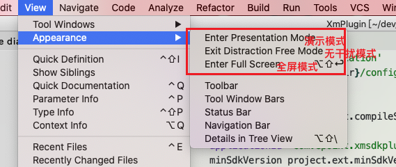
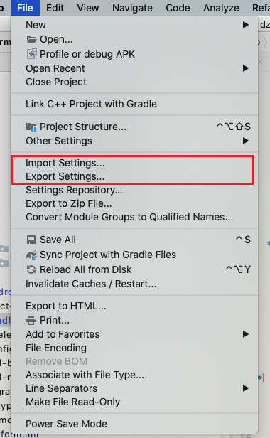
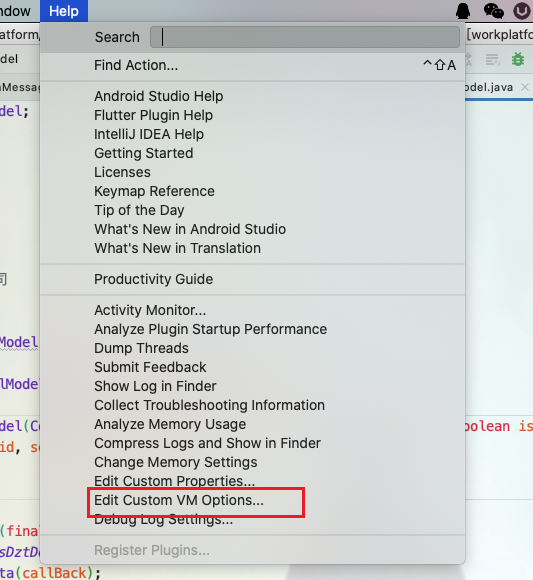
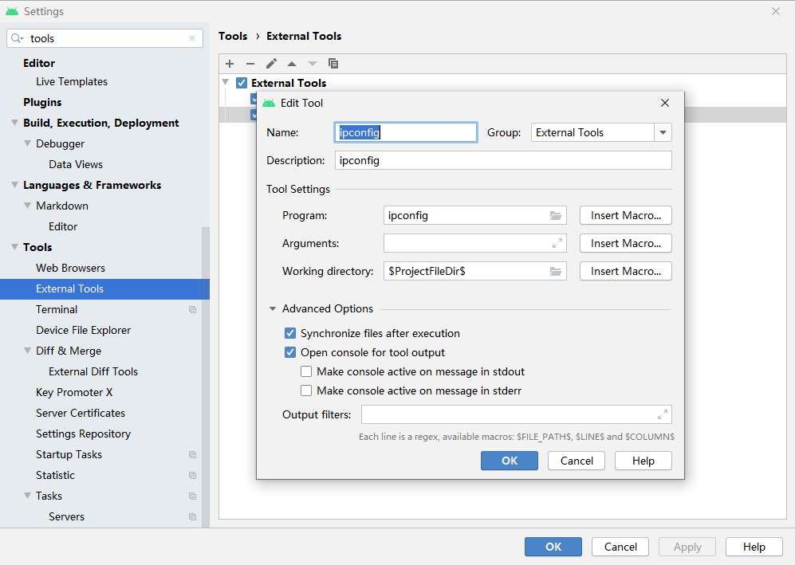
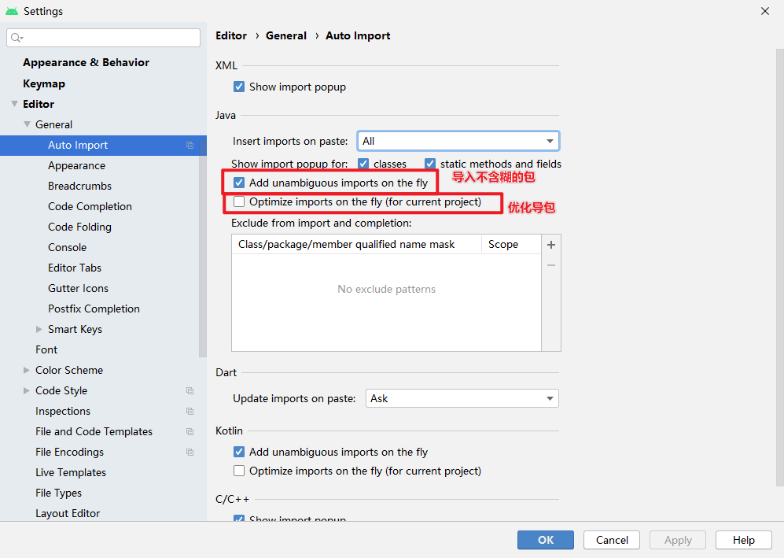
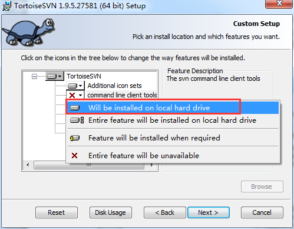
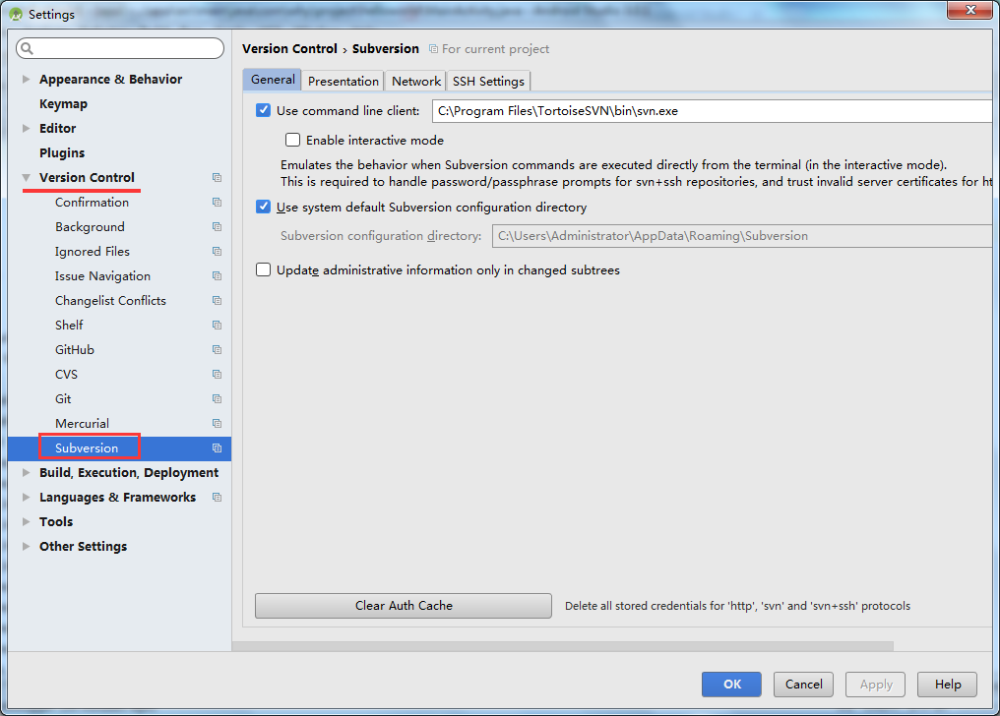

# Android开发技巧介绍

## Android Studio使用

### 常用配置

- 演示模式
- 全屏模式
- 无干扰模式



- 字体及大小  

- 导入导出配置



- vm配置



```porp
-Xms1024m
-Xmx3096m
-XX:ReservedCodeCacheSize=1024m
-XX:+UseConcMarkSweepGC
-XX:SoftRefLRUPolicyMSPerMB=100
-Dsun.io.useCanonCaches=false
-Djava.net.preferIPv4Stack=true
-Djna.nosys=true
-Djna.boot.library.path=

-Dfile.encoding=UTF-8

-da
```

- External Tools



- 自定义Android Studio菜单及操作按钮
- 自动导包
  

### 快捷键

- Ctrl E 最近任务/窗口切换

- Alt 1、2、3、4、5、6、7、8、9  切换工具窗口

- Alt -> <-  切换上一个/下一个tab

- Ctrl Shift L 格式化代码

- Ctrl Shift N 搜索文件

- Ctrl Shift F 全局搜索

- Ctrl Alt F 将局部变量提升为成员变量

- Ctrl Shift U 大小写切换

- Ctrl D 复制行

- Ctrl X 剪切/删除行

- Shift F10 运行

- Shift F9 调试

- Shift Esc 隐藏窗口

## 代码快捷操作

- psfs -> public static final String
- psfi -> public static final int
- 其他代码模板

- Sround with： Ctrl Shift T -> 将选中的代码进行指定代码块的包裹，包括 try catch 、 if 、 region 等

- 代码块折叠/展开
  - Ctrl -
  - Ctrl +
  - Ctrl Shift +
  - Ctrl Shift -

- 推荐使用region配合代码折叠

- debug操作
  - 条件断点
  - 运行到指定位置
  - 执行表达式

常识补充：
debuggable

``` groovy
    buildTypes {
        release {
            signingConfig signingConfigs.config_release
            //开启资源压缩，必须开启混淆
            shrinkResources false
            minifyEnabled false
            debuggable false
            proguardFiles getDefaultProguardFile('proguard-android.txt'), 'proguard-rules.pro'
        }
        debug {
            signingConfig signingConfigs.config_release
            minifyEnabled false
            proguardFiles getDefaultProguardFile('proguard-android.txt'), 'proguard-rules.pro'
        }
    }
```

建议在方法的入参、返回值及类的成员变量上添加
@NonNull
@Nullable

在变量可能为空时，会有颜色提醒

<!-- ### Gradle及android—gradle插件 -->

<!-- android-gradle 3.4.0 R8混淆 -->

### SVN配置及使用




### 实用插件

#### Gradle View

查看依赖

命令：
    gradlew.bat :workplatform:dependencies > appDep.txt

#### Code Glance

#### Easy Gradle

杀死gradle进程

#### ADB Idea

adb工具

#### Rainbow Brackets

彩虹括号

## ViewBinding

视图绑定

Android Studio升级到4.0+

distributionUrl=https\://services.gradle.org/distributions/gradle-6.1.1-all.zip

classpath 'com.android.tools.build:gradle:4.0.1'

buildFeatures {
    dataBinding = true
    viewBinding = true
}

## 本地仓库

远程仓库挂了或者远程仓库数据有问题的临时解决方案——本地仓库

昨天早上私服仓库挂了，党政通的“小伙伴”跟我反馈拉不到包。。不好意思，不是我的锅。

请学会这招，以后别再来找我。

--> D:\develop\localrep

``` groovy
        def deployPath = file("D:\\develop\\localrep")
        maven { url "file://${deployPath.absolutePath}" }
```

## QMUI常用控件介绍

用于布局文件设置控件

com.qmuiteam.qmui.widget.roundwidget.QMUIRoundButton
com.qmuiteam.qmui.widget.roundwidget.QMUIRoundFrameLayout
com.qmuiteam.qmui.widget.roundwidget.QMUIRound***Layout

com.qmuiteam.qmui.widget.QMUIRadiusImageView

用于代码设置控件
com.qmuiteam.qmui.layout.IQMUILayout
com.qmuiteam.qmui.layout.QMUIButton
com.qmuiteam.qmui.layout.QMUIFrameLayout
com.qmuiteam.qmui.layout.QMUI***Layout

## 调试工具

开发者助手

抓包工具
